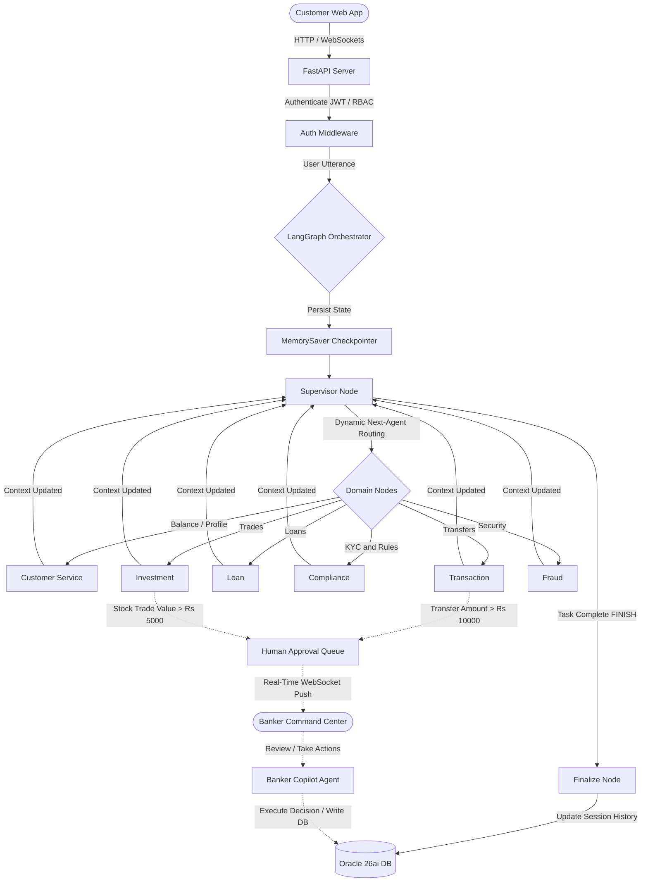
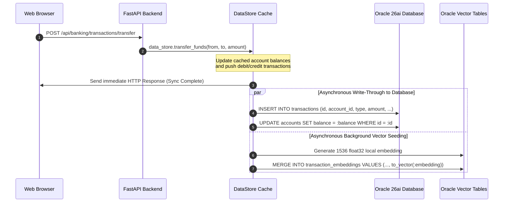
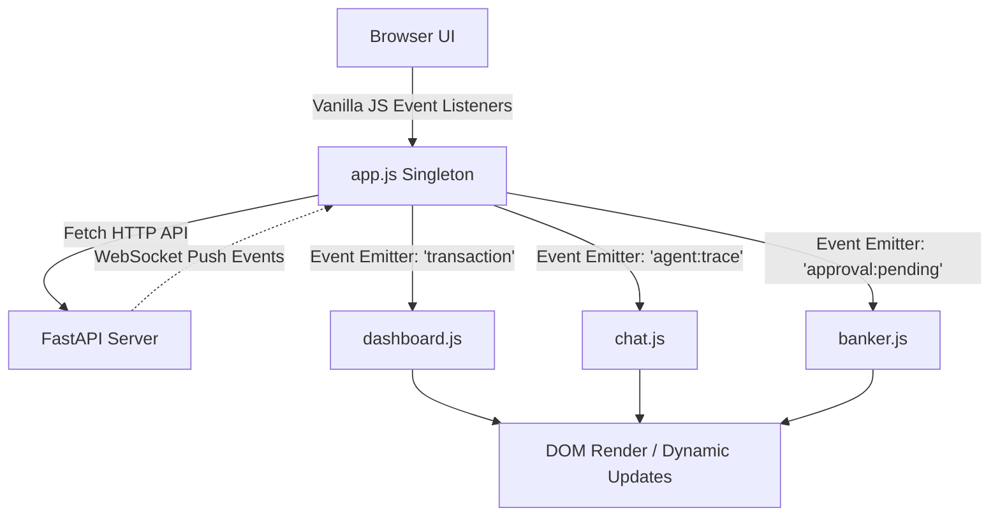
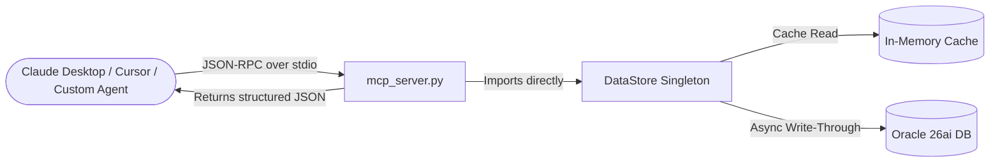

# 🏦 AgenticBank AI — Autonomous Banking Command Center (v2.5 Enterprise)

Welcome to **AgenticBank AI**, a state-of-the-art Autonomous Multi-Agent Banking Orchestrator built using a premium HTML5/Vanilla CSS web client, a high-performance **Python (FastAPI)** backend, **LangChain & LangGraph** for agentic orchestration, and **Oracle 26ai Free** as the single source of truth for both relational schemas and native vector embeddings.

This application acts as an enterprise-grade Proof of Concept (POC) demonstrating the integration of **Generative AI Swarms** with **Robust Database Cache Policies** and **Strict Human-in-the-Loop Controls** to automate modern banking operations securely.

---

## 📐 Architectural Blueprints

### 1. Multi-Agent Message Routing & Cognitive Cycle (LangGraph)
This diagram details the life cycle of a customer interaction using our **Cyclic Supervisor LangGraph Architecture**. Customer messages and states are persisted via `MemorySaver`. A dynamic LLM Supervisor evaluates the state at every hop to decide which domain agent to trigger next, enabling complex multi-agent collaboration loops.



---

### 2. Read-Through / Write-Through Cache Synchronization
AgenticBank AI utilizes a high-performance **write-through cache policy** managed by the application singleton [data_store.py](file:///c:/Projects/Demos%20May/Autonomous%20Banking/src/data/data_store.py). Any changes to user profiles, transactional logs, or account lockouts update the memory caches in real-time before writing through asynchronously to Oracle 26ai, guaranteeing a lag-free UI experience.



---

### 3. Native Oracle 26ai Vector Memory & Semantic Search Loop
To achieve sub-millisecond semantic search without relying on slow and expensive third-party embedding APIs, AgenticBank AI implements a local **token-hashing system** mapping sentences to 1536-dimensional L2-normalized vectors. These are processed natively in Oracle 26ai using the new `VECTOR` column type.

```mermaid
graph LR

    input_node[Query high interest rates] --> tokens[Tokenize and Clean Text]
    tokens --> hash[DJB2 Polynomial Hash]
    hash --> vector[1536 Dim Float32 Array]
    vector --> normalize[L2 Normalization]

    normalize --> sql_query[SELECT document FROM semantic_memory ORDER BY vector_distance]
    sql_query --> db[(Oracle 26ai DB)]

    db -->|Native VECTOR_DISTANCE bind| compare[VECTOR_DISTANCE COSINE]
    compare --> results[Top K Matching Documents]
```



---

### 4. Frontend Architecture (Vanilla JS & WebSockets)
The frontend is purposely designed to be lightweight, fast, and entirely free of heavy build tools (no React, Vue, or Webpack required). It uses **Vanilla JavaScript (ES6)** and a custom event-driven Single-Page Application (SPA) structure.



**Key Frontend Concepts:**
*   **Module Singletons**: Each major view acts as a singleton object (`App`, `Dashboard`, `Chat`, `Banker`, `Memory`).
*   **WebSockets (`ws://`)**: A persistent WebSocket connection is established in `app.js`. The FastAPI server pushes real-time events (like `agent:trace` for thought-logs, `transaction` for live debit/credits, and `approval:pending` for banker alerts).
*   **No Build Step**: Assets are served directly via FastAPI's `StaticFiles`. The HTML files (`customer.html`, `banker.html`) load the CSS variables and script files directly.
*   **Theme & Aesthetics**: Uses CSS Variables (`var(--bg-main)`, `var(--electric)`) to achieve a premium, vibrant light mode with soft box-shadows and glassmorphism elements.

---

### 5. Identity and Access Management (Auth & RBAC)
AgenticBank AI implements strict **Role-Based Access Control (RBAC)** and stateless authentication using modern API gateways and middleware. 

* **Password Security**: When users register or are created by an administrator, their plain-text passwords are never stored. The backend mathematically encrypts them (via `SHA-256` hashing) before storing them in the Oracle database. This guarantees that IT teams and database administrators cannot maliciously expose or misuse user credentials.
* **Stateless JWT Sessions**: Because HTTP is a stateless protocol (the server forgets the browser immediately after sending a response), AgenticBank relies on **JSON Web Tokens (JWT)**. Upon successfully verifying a username and password, the API generates and signs a JWT. The browser attaches this token to all consecutive requests. The backend parses this token to reliably identify the user and maintain session continuity without requiring constant database lookups.
* **Role-Based Access Control (RBAC)**: Every user is assigned a specific governance role (e.g., `Admin`, `Branch Manager`, `Compliance Officer`). The backend uses policy middleware (e.g. `Depends(require_role(...))`) to grant or deny access to specific functionalities. For instance, only a user holding the `Compliance Officer` role is authorized to resolve flagged loans or trigger account lockouts.
* **Single Sign-On (SSO)**: The system natively supports OAuth2 interfaces (`/api/auth/oauth-token`) to allow corporate users to authenticate seamlessly via external federated identity providers.

---

## 🤔 Conceptual FAQ: Why Agents & LangGraph?

When reviewing the source code, you might wonder: *"Why all this orchestration? Why not just use standard Python functions that call each other based on keywords?"*

### What exactly is an "Agent" here?
In traditional software, a Python function executes a rigid, deterministic sequence of code (e.g., `if A then B`). An **Agent** in this architecture is fundamentally different: it is an autonomous LLM wrapper equipped with a system prompt and a discrete set of **Tools** (Python functions). 
Instead of us hard-coding *how* to solve a problem, we simply give the Agent a goal and the tools. The Agent dynamically reasons through the problem, decides *which* tools to call, inspects the returned data, and formulates a final response. 

### Why not simply use Python functions?
If a user says *"Send ₹500 to John, wait actually make it ₹1000 and check if that leaves me with enough for rent"*, a standard Python function built on keyword extraction would shatter instantly. 
1. **Non-linear Reasoning**: Agents can handle unstructured, contradictory, or complex human language natively. 
2. **Contextual Awareness**: If an API call fails (e.g., insufficient funds), an Agent can read the error, pivot its strategy, and suggest alternatives without requiring you to write thousands of `try/catch/else` edge cases.
3. **Tool Chaining**: Agents can execute multiple tools in a loop (e.g., check balance -> see it's low -> fetch investment portfolio -> suggest selling stocks to cover rent).

### The Routing Strategy (Keywords vs. LLM)
At the top of the LangGraph architecture sits the **Supervisor**. To optimize speed and reduce LLM costs, the Supervisor uses a hybrid routing approach:
1. **Keyword Heuristics**: The Supervisor first checks for highly specific triggers (e.g., `transfer`, `balance`, `fraud`). If a keyword matches, it instantly routes to that specific domain agent (O(1) time complexity, zero LLM cost).
2. **LLM Fallback (Semantic Understanding)**: If the user types something ambiguous like *"I lost my wallet in Paris and I need to pay for my hotel right now"*, standard keywords fail. In this case, the Supervisor falls back to an **LLM intent classifier** to semantically understand the emergency, flag it as fraud, and route the user to the Fraud & Transaction agents sequentially. 

---

## 🤖 AI Agent Swarm Directory

All agents inherit from the unified [BaseAgent](file:///c:/Projects/Demos%20May/Autonomous%20Banking/src/agents/base_agent.py) class, giving them built-in support for token-hashed vector memories, execution logs, and automated trace streaming to the UI.

### 1. `CustomerServiceAgent`
*   **Source File**: [customer_service_agent.py](file:///c:/Projects/Demos%20May/Autonomous%20Banking/src/agents/customer_service_agent.py)
*   **Purpose**: Initial customer triage, account summaries, and portal orientation.
*   **Allowed Tools**: `get_user_profile`, `list_accounts`, `get_exchange_rates`.
*   **Capabilities**: Explains portal layouts, lists current balances, calculates currency exchange rates, and automatically suggests switching to a specialized agent when queries exceed general scope.

### 2. `TransactionAgent`
*   **Source File**: [transaction_agent.py](file:///c:/Projects/Demos%20May/Autonomous%20Banking/src/agents/transaction_agent.py)
*   **Purpose**: Execution of fund movements, statements retrieval, and balance check.
*   **Allowed Tools**: `create_transaction`, `transfer_funds`, `get_statement`.
*   **Capabilities**: Processes transfers between checking/savings/credit card accounts. It enforces systemic safety rules: any transfer exceeding **₹10,000** triggers a human-in-the-loop approval request, keeping the transfer in a `pending_approval` state.

### 3. `LoanAgent`
*   **Source File**: [loan_agent.py](file:///c:/Projects/Demos%20May/Autonomous%20Banking/src/agents/loan_agent.py)
*   **Purpose**: Debt simulation, monthly payment calculation, and loan underwriting.
*   **Allowed Tools**: `get_loans`, `calculate_amortization`, `apply_for_loan`.
*   **Capabilities**: Computes monthly payments, displays payment splits (interest vs. principal), and creates loan records. Applications are added to the database under the status `pending_approval` for review by a banker.

### 4. `InvestmentAgent`
*   **Source File**: [investment_agent.py](file:///c:/Projects/Demos%20May/Autonomous%20Banking/src/agents/investment_agent.py)
*   **Purpose**: Asset trading, price monitoring, and wealth analysis.
*   **Allowed Tools**: `get_portfolio`, `execute_trade`, `get_stock_prices`.
*   **Capabilities**: Queries portfolios and stock listings. It executes buy/sell orders. If a trade’s value exceeds **₹5,000**, the trade is halted, and a human approval request is posted.

### 5. `ComplianceAgent`
*   **Source File**: [compliance_agent.py](file:///c:/Projects/Demos%20May/Autonomous%20Banking/src/agents/compliance_agent.py)
*   **Purpose**: Regulatory compliance audit, KYC checks, and customer complaint logging.
*   **Allowed Tools**: `get_kyc_status`, `file_complaint`, `update_complaint_status`, `get_audit_logs`.
*   **Capabilities**: Evaluates KYC verified flags, creates support tickets with priority status (Low, Medium, High), and logs action audits.

### 6. `FraudAgent`
*   **Source File**: [fraud_agent.py](file:///c:/Projects/Demos%20May/Autonomous%20Banking/src/agents/fraud_agent.py)
*   **Purpose**: Real-time transaction scanning.
*   **Allowed Tools**: `scan_risk_score`, `trigger_account_lockout`, `post_security_alert`.
*   **Capabilities**: Operates on an event-driven basis. Whenever a transaction is processed, `FraudAgent` scans transaction properties. If a risk score exceeds **0.6**, it emits a security alert to the websocket server, triggers a live system alert on the Banker Portal, and flags the user's accounts for investigation.

### 7. `MemoryAgent`
*   **Source File**: [memory_agent.py](file:///c:/Projects/Demos%20May/Autonomous%20Banking/src/ai/memory_agent.py)
*   **Purpose**: Background memory extraction and consolidation.
*   **Allowed Tools**: `seed_semantic_from_banking`, `add_episodic_event`, `set_semantic_fact`.
*   **Capabilities**: Evaluates conversation logs to identify user facts (*"planning a trip to Europe"*, *"dislikes high-risk assets"*) and saves them as vectors in Oracle DB to customize long-term interactions.

### 8. `BankerCopilotAgent`
*   **Source File**: [banker_copilot_agent.py](file:///c:/Projects/Demos%20May/Autonomous%20Banking/src/agents/banker_copilot_agent.py)
*   **Purpose**: Administrative copilot for authenticated banking personnel.
*   **Allowed Tools**: `resolve_approval`, `freeze_user_accounts`, `unfreeze_user_accounts`, `audit_transaction_risks`, `update_complaint`, `query_vector_histories`.
*   **Capabilities**: Sits behind the secure Banker Dashboard. It allows bankers to command operations via chat, freeze customer profiles immediately, resolve pending transfers/trades, and search past customer conversations.

---

## 🛠️ Complete System Functionalities & Features

This POC is packed with enterprise-grade banking capabilities designed to demonstrate what AI-native infrastructure looks like. Here is an exhaustive list of features:

### 🧠 Core AI & Infrastructure Features
*   **LangGraph Stateful Routing**: Utterances aren't blindly sent to an LLM. They are routed via a deterministic state graph to the correct specialized domain agent.
*   **Native Vector Search (Oracle 26ai)**: Embeddings for semantic facts (e.g., "User wants to buy a house") and episodic chat histories are saved natively in Oracle 26ai `VECTOR` columns and queried via `VECTOR_DISTANCE` with `COSINE` similarity.
*   **Write-Through Caching**: The Python `data_store.py` class caches users, accounts, and transactions in memory. All reads are 0ms. Writes are immediately synced to the cache and asynchronously pushed to Oracle.
*   **Database Self-Healing**: If the Oracle database is completely wiped or new, the server automatically detects empty tables on startup and seeds them with rich mock data.
*   **Real-time Event Streaming**: A centralized WebSocket server pushes granular updates to connected clients (both customers and bankers) instantly.

### 💻 Customer Portal Features (`customer.html`)
The customer UI is a fully responsive single-page web app styled with premium modern typography and cohesive light mode variables:
*   **Live Dashboard**: Highlights net worth, monthly spending, and debt. Includes interactive visual charts for portfolio assets and lists recent transaction items.
*   **Dynamic Chat Terminal**:
    *   *Session Manager*: Create new chat threads, rename titles, switch to past sessions, or clear histories. Sessions are saved directly into the Oracle Database and persist across restarts.
    *   *Agent Handoff Indicator*: Displays which agent is actively handling the request (e.g. *Compliance Agent*, *Investment Agent*).
    *   *AI Thought Trace*: Collapsible drawer showing the internal reasoning, tools chosen, and latency values for each conversation turn.
*   **Simulated Funds Transfer**: Select source account, destination account number, and amount.
*   **Interactive Loan Center**: Calculate compound interest payments dynamically and submit applications.
*   **Active Wealth Management**: Real-time ticker values, portfolio allocations, and trading tools.
*   **Support Ticket Center**: Form to submit tickets, check ticket status, and read banker replies.

### 🏢 Banker Portal Features (`banker.html`)
Accessible via `/banker.html`, this portal serves as the control center for bank staff:
*   **Command Center Stats**: Displays total assets, active loans pending review, resolved complaint ratios, and system status markers.
*   **Human-In-The-Loop Approval Grid**: Displays pending large transfers (>$10,000) or trades (>$5,000). Bankers can click *Approve* (marking the state as completed in Oracle) or *Reject* (canceling the action).
*   **Customer Directory & Financial Intelligence**:
    *   Lists all registered customers with KYC badges.
    *   **Financial Intelligence Sidebar**: Automatically calculates advanced analytics on the fly, including:
        *   **Debt-to-Income (DTI) Ratio**
        *   **Credit Utilization Rate**
        *   **Recommended Action Matrix** (e.g., recommend locking user, offering premium cards, etc.)
*   **Live Feed**: WebSocket feed showing system-wide transactions, loan requests, and memory indexing events.
*   **AI Banker Copilot Chat**: An interface allowing bankers to query the AI, run vector queries, and take administrative actions directly through chat.
    *   **Persistent Sessions**: Copilot chats are saved directly to the Oracle database under the banker's credentials, allowing them to switch between active investigations seamlessly.
    *   **Instant Context Actions**: 'Consult Copilot' buttons next to alerts and complaints instantly load the customer context and issue into the chat for automated review and resolution.
    *   **Account Freezing**: Bankers can command the Copilot to "Freeze all accounts for user USR-003", which the Copilot executes via its internal tools.

---

## 🗄️ Oracle 26ai Database Schema

The database relies on 12 tables mapped in **FREEPDB1**. Large JSON blocks are stored natively in `CLOB` fields, while AI memories are stored using Oracle's native `VECTOR` type.

```
                  +-------------------------------------------------------+
                  |                 Oracle 26ai Database                  |
                  +-------------------------------------------------------+
                                              |
       +--------------------------------------+------------------------------------+
       |                                      |                                    |
 +------v-------+                       +------v-------+                     +------v-------+
 |  Relational  |                       |  Logs & Queues|                     |   AI Memory  |
 +--------------+                       +--------------+                     +--------------+
 | * users      |                       | * approval_q |                     | * episodic_m |
 | * accounts   |                       | * audit_logs |                     | * semantic_m |
 | * transactions                       | * sessions   |                     | * txn_embeds |
 | * loans      |                       +--------------+                     +--------------+
 | * portfolios |
 | * complaints |
 | * bankers    |
 +--------------+
```

### Table Definitions & Vector Columns

#### 1. `bankers`
Contains administrative staff profiles.
```sql
CREATE TABLE bankers (
  id VARCHAR2(50) PRIMARY KEY,
  username VARCHAR2(50) UNIQUE,
  password_hash VARCHAR2(128),
  name VARCHAR2(100),
  role VARCHAR2(50)
);
```

#### 2. `users`
Stores user profile, credit profiles, and KYC statuses.
```sql
CREATE TABLE users (
  id VARCHAR2(50) PRIMARY KEY,
  first_name VARCHAR2(50),
  last_name VARCHAR2(50),
  email VARCHAR2(100),
  phone VARCHAR2(30),
  dob VARCHAR2(30),
  ssn VARCHAR2(20),
  address CLOB,               -- Address details stored as JSON
  occupation VARCHAR2(100),
  employer VARCHAR2(100),
  annual_income NUMBER,
  credit_score NUMBER,
  kyc_status VARCHAR2(30),
  kyc_date VARCHAR2(30),
  risk_profile VARCHAR2(30),
  join_date VARCHAR2(30)
);
```

#### 3. `accounts`
Stores banking accounts and balances.
```sql
CREATE TABLE accounts (
  id VARCHAR2(50) PRIMARY KEY,
  user_id VARCHAR2(50) REFERENCES users(id),
  type VARCHAR2(30),          -- checking, savings, credit
  name VARCHAR2(100),
  balance NUMBER,
  currency VARCHAR2(10),
  account_number VARCHAR2(30),
  routing_number VARCHAR2(30),
  status VARCHAR2(30),        -- active, frozen
  interest_rate NUMBER,
  credit_limit NUMBER
);
```

#### 4. `transactions`
Logs all transaction details.
```sql
CREATE TABLE transactions (
  id VARCHAR2(50) PRIMARY KEY,
  account_id VARCHAR2(50) REFERENCES accounts(id),
  type VARCHAR2(30),          -- credit, debit
  amount NUMBER,
  merchant VARCHAR2(100),
  category VARCHAR2(50),
  description VARCHAR2(500),
  date_val VARCHAR2(50),
  status VARCHAR2(30),
  risk_score NUMBER
);
```

#### 5. `loans`
Manages customer active and pending loans.
```sql
CREATE TABLE loans (
  id VARCHAR2(50) PRIMARY KEY,
  user_id VARCHAR2(50) REFERENCES users(id),
  type VARCHAR2(30),
  amount NUMBER,
  remaining_balance NUMBER,
  interest_rate NUMBER,
  term_months NUMBER,
  monthly_payment NUMBER,
  status VARCHAR2(30),        -- pending_approval, approved, rejected
  start_date VARCHAR2(30),
  purpose VARCHAR2(500)
);
```

#### 6. `portfolios`
Maintains customer wealth management allocations.
```sql
CREATE TABLE portfolios (
  user_id VARCHAR2(50) PRIMARY KEY REFERENCES users(id),
  account_id VARCHAR2(50) REFERENCES accounts(id),
  risk_tolerance VARCHAR2(30),
  total_value NUMBER,
  holdings CLOB               -- Array of assets (Symbol, Qty, Cost) stored as JSON
);
```

#### 7. `complaints`
Logs support tickets.
```sql
CREATE TABLE complaints (
  id VARCHAR2(50) PRIMARY KEY,
  user_id VARCHAR2(50) REFERENCES users(id),
  subject VARCHAR2(200),
  description VARCHAR2(1000),
  status VARCHAR2(30),        -- pending, resolved
  date_val VARCHAR2(30),
  priority VARCHAR2(20)       -- low, medium, high
);
```

#### 8. `approval_queue`
Saves actions requesting human reviews.
```sql
CREATE TABLE approval_queue (
  id VARCHAR2(50) PRIMARY KEY,
  user_id VARCHAR2(50) REFERENCES users(id),
  type VARCHAR2(30),          -- large_transfer, equity_trade
  status VARCHAR2(30),        -- pending, approved, rejected
  reason VARCHAR2(500),
  details CLOB,               -- Structured payload of action details as JSON
  requested_at VARCHAR2(50),
  resolved_at VARCHAR2(50),
  reviewer_note VARCHAR2(500)
);
```

#### 9. `sessions`
Saves customer chat histories.
```sql
CREATE TABLE sessions (
  id VARCHAR2(100) PRIMARY KEY,
  user_id VARCHAR2(50) REFERENCES users(id),
  title VARCHAR2(200),
  updated_at VARCHAR2(50),
  messages CLOB,              -- Complete array of chat messages as JSON
  agent_histories CLOB        -- Trace records of internal agent hops as JSON
);
```

#### 10. `episodic_memory` (Vector)
Stores past conversational events.
```sql
CREATE TABLE episodic_memory (
  id VARCHAR2(100) PRIMARY KEY,
  user_id VARCHAR2(50) REFERENCES users(id),
  document CLOB,
  metadata CLOB,
  timestamp VARCHAR2(50),
  embedding VECTOR(1536, FLOAT32)
);
```

#### 11. `semantic_memory` (Vector)
Stores key user preferences and attributes.
```sql
CREATE TABLE semantic_memory (
  id VARCHAR2(100) PRIMARY KEY,
  user_id VARCHAR2(50) REFERENCES users(id),
  key VARCHAR2(100),
  document CLOB,
  metadata CLOB,
  embedding VECTOR(1536, FLOAT32)
);
```

#### 12. `transaction_embeddings` (Vector)
Allows semantic natural language query over transaction logs.
```sql
CREATE TABLE transaction_embeddings (
  id VARCHAR2(100) PRIMARY KEY,
  user_id VARCHAR2(50) REFERENCES users(id),
  document CLOB,
  metadata CLOB,
  embedding VECTOR(1536, FLOAT32)
);
```

---

## 🚀 Local Installation & Setup (Foolproof Guide)

Follow these step-by-step instructions to get AgenticBank AI running flawlessly on a brand new Windows, macOS, or Linux machine.

### Step 1: Clone the Repository
Open your terminal and clone the repository to your local machine:
```bash
git clone https://github.com/your-org/autonomous-banking.git
cd autonomous-banking
```

### Step 2: Set Up Python Virtual Environment
Ensure you have **Python 3.10+** installed. It is highly recommended to use a virtual environment to avoid dependency conflicts.
```bash
# Create a virtual environment named 'venv'
python -m venv venv

# Activate the virtual environment
# On Windows (PowerShell):
.\venv\Scripts\Activate.ps1
# On Windows (Command Prompt):
.\venv\Scripts\activate.bat
# On macOS/Linux:
source venv/bin/activate
```

### Step 3: Install Python Dependencies
With your virtual environment active, install the required packages:
```bash
pip install -r requirements.txt
```

### Step 4: Install & Configure Oracle Database 23ai/26ai Free
The backend relies entirely on Oracle's native `VECTOR` capabilities.
1. Download **Oracle Database Free Edition** from the [official Oracle website](https://www.oracle.com/database/free/).
2. Run the installer and leave the default port as `1521`.
3. Connect to the local database using SQL*Plus (which comes with the installation) or SQL Developer. Log in as `SYS` as `SYSDBA`:
   ```bash
   sqlplus sys as sysdba
   ```
4. Execute the following SQL commands to create the `banking` user and grant the necessary permissions inside the pluggable database (`FREEPDB1`):
   ```sql
   ALTER SESSION SET CONTAINER = FREEPDB1;
   CREATE USER banking IDENTIFIED BY oracle;
   GRANT CONNECT, RESOURCE, DBA TO banking;
   ALTER USER banking QUOTA UNLIMITED ON users;
   EXIT;
   ```

### Step 5: Configure Environment Variables
Copy the example environment file and add your actual API keys.
```bash
# Windows
copy .env.example .env
# macOS/Linux
cp .env.example .env
```
Open the `.env` file in your editor and ensure the following keys are set:
```ini
# === Deepseek / OpenAI API Configuration ===
# Get an API key from platform.deepseek.com or platform.openai.com
DEEPSEEK_API_KEY=your_actual_api_key_here
DEEPSEEK_BASE_URL=https://api.deepseek.com
DEEPSEEK_MODEL=deepseek-chat
DEEPSEEK_REASONING_MODEL=deepseek-reasoner

# === Oracle Database Configuration ===
ORACLE_USER=banking
ORACLE_PASSWORD=oracle
ORACLE_CONNECT_STRING=localhost:1521/FREEPDB1

# === Server Configuration ===
PORT=3000
```

### Step 6: Start the FastAPI Server
Run the application server. The startup script will automatically connect to Oracle, create all required tables, and seed the database with simulated users, mock transactions, and native AI vector embeddings.
```bash
python src/server.py
```
*Note: The first time you run this, it may take 10-15 seconds to generate and insert the initial vector embeddings into the Oracle database.*

---

## 🔑 Default Portal Login Credentials

### Customer Portal
1.  Go to `http://localhost:3000`.
2.  Log in using any seeded customer email:
    *   **Email**: `sarah.mitchell@example.com`
    *   **Password**: `password` *(Note: Any password is accepted for customer log-ins in development mode)*

### Banker Portal
1.  Go to `http://localhost:3000/banker.html` (or click "Go to Banker Portal" on the login screen).
2.  Log in as either administrative role:
    *   **Compliance Officer**:
        *   **Username**: `agent1`
        *   **Password**: `password`
    *   **Fraud Analyst**:
        *   **Username**: `agent2`
        *   **Password**: `password`

---

## 🔌 MCP Server — Machine-to-Machine Banking Interface

AgenticBank AI ships a fully functional **MCP (Model Context Protocol) Server** that exposes the entire banking backend as a structured, discoverable set of tools for external LLM clients. This lets any MCP-compatible AI assistant (Claude Desktop, Cursor, custom agents) directly read customer data, analyse financials, execute transfers, manage complaints, and action the approval queue — all through natural language.

### What is MCP?

MCP (Model Context Protocol) is an open standard developed by Anthropic that defines how AI models communicate with external tools and data sources. Think of it as a universal plug that lets an LLM "reach into" your system and call real functions — safely, structured, and with full type schemas. Instead of copy-pasting data into a chat window, you connect your system once and the LLM can query it live at any time.

### How it Works in This Project



1. **The MCP server** (`src/mcp_server.py`) is a standalone Python process that runs alongside (or independently of) the FastAPI web server.
2. When launched, it initialises the **same Oracle database connection pool** and loads all customer data into the in-memory cache — exactly like the main server does.
3. Your MCP client (e.g., Claude Desktop) connects to this process over **stdio** (standard input/output), which is the MCP standard for local servers.
4. The client sends a `tools/list` request; the MCP server responds with the full schema of all 19 registered tools.
5. When the LLM decides to call a tool (e.g., `get_financial_intelligence`), it sends a `tools/call` request with the arguments. The MCP server executes the function against the live data store and returns a clean JSON result.
6. The LLM incorporates the result into its reasoning and generates a human-readable response.

> [!NOTE]
> All write operations (transfers, approvals, complaints) in the MCP server go through the **same DataStore singleton** as the web app. This means changes made via the MCP client are reflected live in the web UI — they share the same Oracle database backend.

### Registered Tools (19 total)

| Tool | Category | Description |
|---|---|---|
| `get_user_profile` | Customer | Full customer profile including KYC, credit score, risk rating |
| `list_all_users` | Customer | Summary list of all registered customers |
| `get_financial_intelligence` | Customer | DTI ratio, monthly debt load, mortgage details |
| `get_dashboard_stats` | Customer | Net worth, 30-day spending, income, pending approvals |
| `list_accounts` | Accounts | All checking/savings/credit accounts for a user |
| `get_account_details` | Accounts | Full details of a single account by ID |
| `get_total_balance` | Accounts | Sum of all non-credit account balances |
| `get_transactions` | Transactions | Recent transactions across all user accounts |
| `get_account_transactions` | Transactions | Transactions for a specific account |
| `transfer_funds` | Transactions | Execute a ledger transfer (>₹10k triggers approval gate) |
| `get_loans` | Loans | All loans for a user with balance and status |
| `get_loan_details` | Loans | Full details of a specific loan |
| `get_portfolio` | Investments | Holdings, shares, avg cost, total portfolio value |
| `get_market_data` | Investments | Live prices and sector info for all tracked stocks |
| `get_complaints` | Complaints | All support tickets filed by a user |
| `create_complaint` | Complaints | File a new support complaint on behalf of a user |
| `get_pending_approvals` | Compliance | All items awaiting banker review in the approval queue |
| `resolve_approval` | Compliance | Approve or reject a queued item (audited action) |
| `get_audit_log` | Compliance | Recent system audit trail entries |

### Starting the MCP Server

Run from the project root:

```bash
python src/mcp_server.py
```

The server will:
1. Connect to Oracle 26ai and populate the data cache
2. Start the MCP stdio loop and wait for client connections

### Connecting Claude Desktop

Add the following block to your Claude Desktop config file:

**Windows**: `%APPDATA%\Claude\claude_desktop_config.json`
**macOS**: `~/Library/Application Support/Claude/claude_desktop_config.json`

```json
{
  "mcpServers": {
    "agenticbank": {
      "command": "python",
      "args": ["C:/Projects/Demos May/Autonomous Banking/src/mcp_server.py"],
      "env": {
        "ORACLE_HOST": "localhost",
        "ORACLE_PORT": "1521",
        "ORACLE_DB": "FREEPDB1",
        "ORACLE_USER": "BANKING",
        "ORACLE_PASSWORD": "your_password",
        "DEEPSEEK_API_KEY": "your_key"
      }
    }
  }
}
```

Restart Claude Desktop. You will see **AgenticBank AI** listed as a connected MCP server. You can then ask Claude things like:

> *"Show me all pending approvals in AgenticBank"*
> *"What is Sarah Mitchell's credit score and DTI ratio?"*
> *"Transfer ₹5,000 from ACC-1001 to ACC-1002 for rent"*
> *"Get the audit log for the last 10 actions"*

### Why This Is Powerful for a Banking POC

- **External AI Governance**: A compliance AI agent running externally can connect, scan all pending approvals, and auto-flag anomalies without being embedded in the application itself.
- **Zero UI Required**: Developers and analysts can query the full banking system from their IDE (Cursor MCP) or AI assistant without opening a browser.
- **Composable Workflows**: External agents can chain multiple tools together — e.g., pull a user's financial intelligence, check their portfolio, assess risk, and file a compliance report in a single reasoning loop.
- **Audit-Safe**: Every write through the MCP server goes through the same `DataStore._audit()` trail as the web app, keeping a complete record of all AI-initiated actions.
